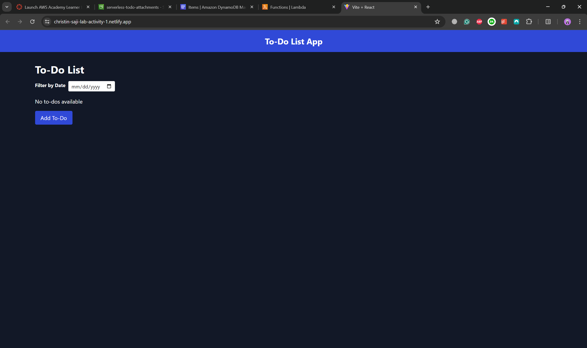
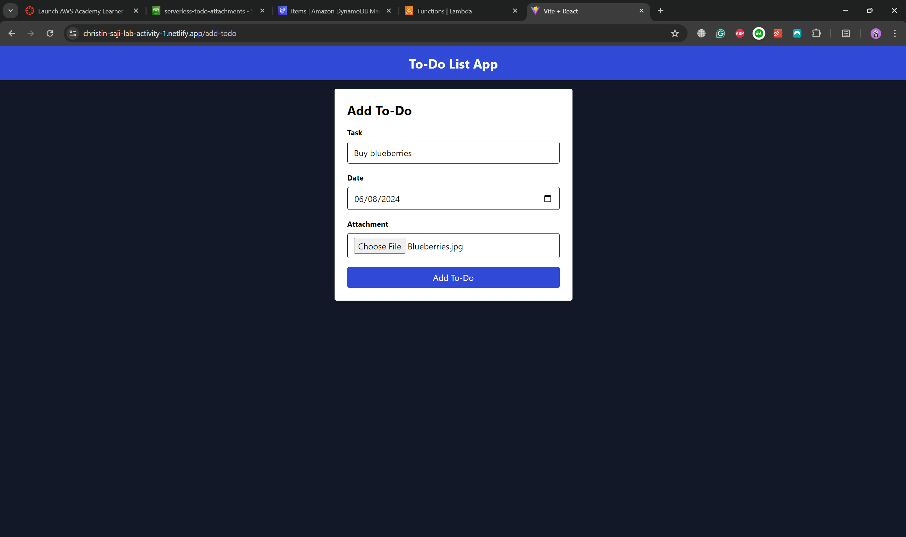
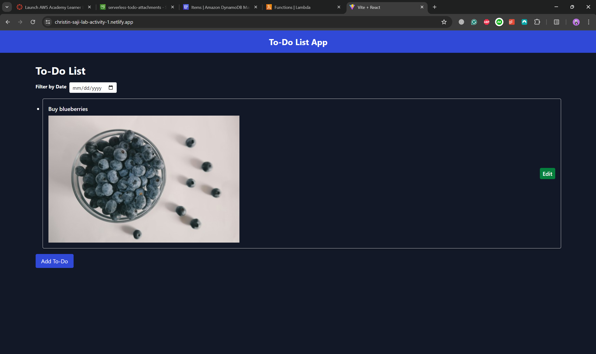
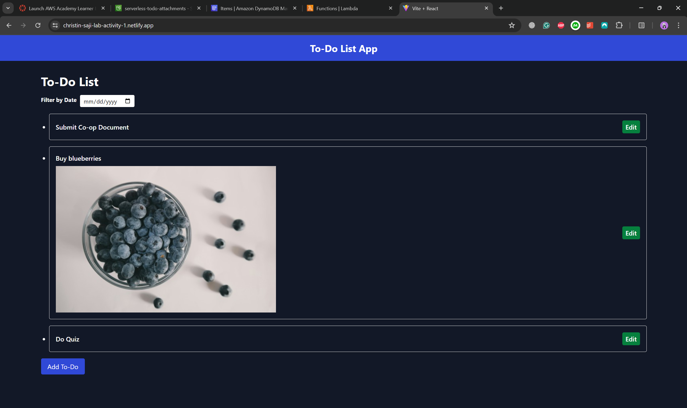
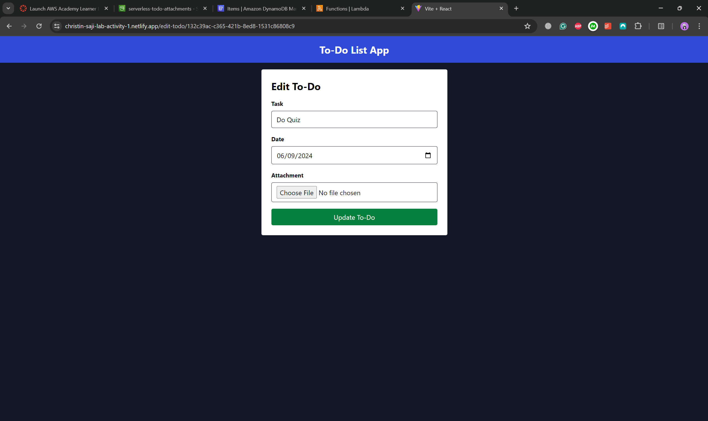
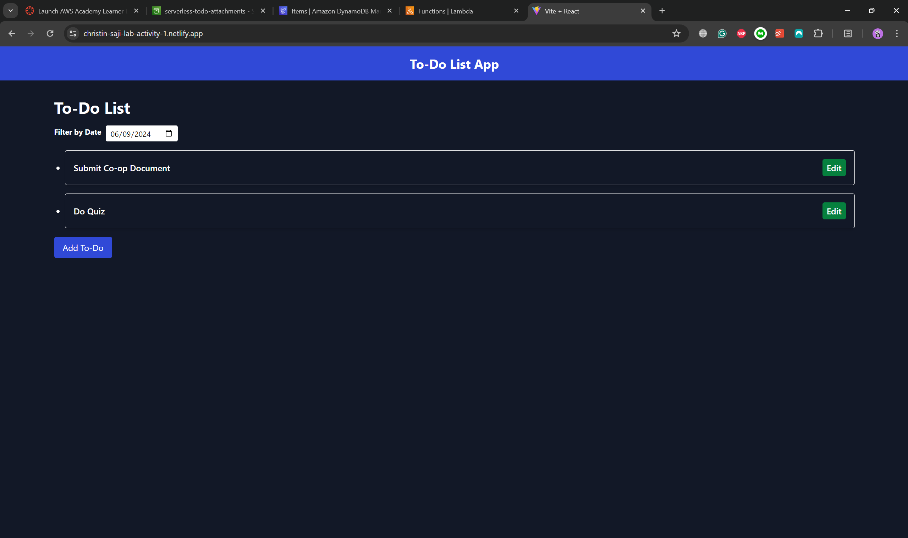

# To-Do App

## Overview

The To-Do App is a serverless application designed to help users efficiently manage their tasks. Built using a combination of AWS services, the app showcases a scalable and cost-effective approach to task management. It integrates AWS Lambda for backend processing, Amazon S3 for file storage, and Amazon DynamoDB for data management. The frontend is developed using React and styled with TailwindCSS, providing a responsive and user-friendly interface.

## Features

- **Add To-Do Item**: Create new tasks with optional attachments.
- **Edit To-Do Item**: Update existing tasks and manage attachments.
- **View To-Do Items**: Display all tasks stored in the database.
- **Filter To-Do Items by Date**: Filter tasks based on a selected date for easier management.

## Architecture

This application leverages several AWS services to provide a seamless and efficient user experience:

- **AWS Lambda**: Handles the backend logic in Python, executing functions for CRUD operations and interacting with other AWS services.
- **Amazon S3**: Stores file attachments related to tasks in a secure and scalable manner.
- **Amazon DynamoDB**: Manages task details, offering fast and predictable performance with seamless scalability.
- **Netlify**: Hosts the frontend of the application, allowing for easy deployment and automatic scaling.

## Technology Stack

- **Frontend**: React, TailwindCSS, Vite
- **Backend**: AWS Lambda (Python)
- **Database**: Amazon DynamoDB
- **File Storage**: Amazon S3
- **Hosting**: Netlify

## Development Process

1. **Requirement Analysis**: Identified core functionalities such as adding, editing, viewing, and filtering To-Do items, along with the need for file attachments.
2. **Architecture Design**: Chose a serverless architecture using AWS Lambda for backend processing in Python, Amazon S3 for attachments, and Amazon DynamoDB for task details.
3. **Frontend Development**: Built a responsive UI using React, with React Router for navigation and TailwindCSS for styling.
4. **Backend Development**: Created AWS Lambda functions in Python for handling CRUD operations and managing interactions with DynamoDB and S3.
5. **Integration and Testing**: Connected the frontend with backend endpoints and thoroughly tested all functionalities, ensuring robust file handling and user experience.

## Setup and Deployment

1. **Clone the Repository**:

   ```bash
   git clone https://github.com/ChristinSaji/Todo-App.git
   cd todo-app
   ```

2. **Install Dependencies**:

   ```bash
   npm install
   ```

3. **Run the Application Locally**:

   ```bash
   npm run dev
   ```

4. **Deploy to Netlify**:

   - Log in to Netlify and create a new site.
   - Connect your repository to Netlify.
   - In the build settings, set the build command to `npm run build` and the publish directory to `dist`.
   - Deploy the site.

## Usage

- Visit the deployed application at: [https://christin-saji-lab-activity-1.netlify.app/](https://christin-saji-lab-activity-1.netlify.app/)
- Use the "Add To-Do" button to create new tasks.
- Click on "Edit" to modify existing tasks or manage attachments.
- Use the date filter to view tasks scheduled for a specific date.

## Screenshots

- **Initial State**: Shows the app with no tasks.

  

- **Add Task**: Form interface for adding new tasks, including task name, date, and optional image attachment.

  

- **Task Display**: Displays newly added tasks on the dashboard with attached images.

  

  

- **Edit Task**: Allows editing of task details and updates storage in DynamoDB and S3.

  

- **Filter Tasks**: Demonstrates date-based filtering of tasks on the dashboard.

  

## Contributing

Contributions are welcome! Please open an issue or submit a pull request for any changes or improvements.

## References

- [TailwindCSS](https://tailwindcss.com/docs/installation)
